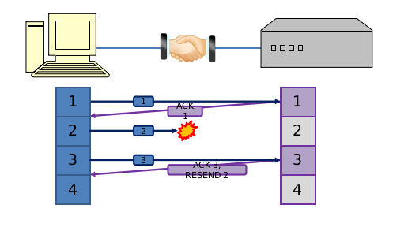

# Ağ Protokolleri (TCP/IP)

## Protocol Stacks (Protokol Yığınları)

İnternet tasarlanırken birden fazla katmandan oluşarak tasarlanmıştır. Katman katmandan
tasarlanmıştır. Yani bir bilgisayarda internet girene kadar değişik katmanlardan
geçen bilgi vardır.Katman katman olma sebebi ise en alt katman olan Physical Katmanını(Fiziksel Katman), moduler yapmak ve boylelikle üst katmanların alt katmanlarla ilişkisi kesmek. Buna da abstruction yani Soyutlandırma denir. Soyutlama işlemi programalanın farklı alanlarında da kullanılır. Her katman birbirleriyle bilgi alış-verişinde bulunur.

- Physical(Fiziksel) Katmanı: Sinyal, Sinyal seviyesinde çalışır.Fiziksel katman, verilerin içinde geçtiği fiziksel ortamı tanımlar.
  Ethernet kablolarını, Ağ Arabirimi Denetleyicilerini ve benzeri şeyleri düşünün. Aynı zamanda ağ ve ağ iletişim cihazları arasındaki arayüzü sağlar.

- Link Katmanı: Ethernet Protocol, Gidilecek yolu belirlemede, Ethernet bağlantısı
  gibi düşünebilirsiniz. Bir Network'e bağlandığınız zaman o Network üzerinde her
  bilgisayarın kendisine ait bazı paketler taşıması söz konusudur. Mesala bu paketler
  nasıl dolaşak, o küçük Network içinde herkese bu paketler nasıl gönderilecek, İlgili kişi mi
  alacak, yoksa paketler birbirinin üzerinde atlayarak mı gidecek bu gibi konular Link
  Katmanında.

- Network Katmanı: IP Adresi Network Katmanı çalışır. Bir Ip adresi verir.
  Mesala Dünyanın bir ucundan diğer ucundaki yere Paket gönderiyoruz. Ve paketlerin
  nereden gidileceğini, nasıl gidileceğini, hangi yollarla gidileceğini, yolunu nasıl
  bulacağı Network Katmanın problemlerindedir.

- Application Katmanı: Üzerinde bir uygulama çalıştırıyoruz. Bu uygulama ise karşıdaki
  uygulamayla iletişime geçiyor(konuşuyor).Örnegin Web Serverına bağlanıcaksınız, bilgi
  sayardaki web browserınız sayesinde karşı tarafa bağlanabiliyorsunuz.Dolayısıyla
  burada uygulamalar birbirleriyle konuşuyorlar. Uygulamanın gönderdiği paketi anca
  uygulama açar. Örnegin http protokolu ile uygulamalar konuşur çünkü ordaki konuşma
  protokolu http dir ve bu protokol ile konuşulur.
  Başka bir örnek Dosya Transferi (File Transfer Protocol (FTP)) gibi.

- \*\*\*Transport Katmanı: App. katmanı ve Network katmanı arasında veri alış-verişi dışında
  Karşı taraftaki Transport Katmanı ile de konuşur. Örneğin bütün paketlerin sırayla
  gelmesini, paketlerin hepsinin karşı tarafa ulaşması gibi konuları Transport Katmanı
  ilgilenir.

Aslında Trasnport Katmanında TCP(Transport Control Protocol)'den bahsedilir.
Altında da IP vardır yani Network Katmanı vardır.Bu katmanda TCP olması şart değildir.
UDP(User Datagram Protocol)'de kullanılabilir TCP'nin UDP'den farkı ise sizin gönderdiğiniz paketlerin karşı
tarafa ulaştığını garanti ediyor olmasıdır. UDP'de ise işler boyle değildir paketlerin
hepsinin gitmesi şart değildir. Ne kadar paket alabilirse alır mantığı vardır.
Bu mantık nerelerde kullanılıyor mesela saniyede 60 frame gönderilen Görüntülü Sohbet
esnasında bir kopukluk olması halinde 1 frame kaybolması halinde ufak bir takilmadan
sonra devam eder diğer framelere atlayabilir bu kabul edilebilir bir durumdur Dolayısıyla
her paketin gitmesi gerekmeyen protokollerde vardır UDP gibi. Ama TCP'nin özelliği
her paketi karşı tarafa gönderiyor olması.

## Transport Layer: TCP(Transport Control Protocol)

- #### Veriyi paketlere bölüyor.

  Eğer bir mailiniz var ve içinde binlerce sayfa yazı yazdınız, ve üstüne video eklediniz
  bu büyük boyuttaki veriyi eğer bir bütün halinde gönderilirse yavaş ve verinin kaybolması
  gibi riskler vardır. Bundan dolayı TCP datayı 1500Bit'lik paketlere bölüyor.

- #### Her paketi belli bir sıraya koyuyor. Her bir pakete bir numara veriyor çünkü

  karşı taraf bu paketleri aldığında sıraya koyması gerekiyor.

- #### Portların & Sessions Trafiğini Ayarlıyor: Yani iki tarafında Network üzerinde
  hangi portlarda konuşacağını ayarlıyor. Network katmanında bir IP numrası verdik
  ama sadece IP numarası değil bunun üzerinde TCP portların ayarlanması gerekiyor.

(Port: Bir bilsayarın üzerinde birden fazla kapı olabilir, ve bu kapılardan içeriye
giriliyor olabilir. Siz o bilgisayarda hangi kapıdan gireceğiniz ve onun cevabı
sizin hangi kapınızdan giriceği iki tarafın portlarıyla oluyor. Burdaki IP numarası
burdaki Ip ile konuşuyor ama aynı zamanda burdaki başka bir uygulama ordaki başka
bir uygulamayla da konuşabilir.Örnegin google ile bir arama yapıyorken google gmail
ile maillerinizi indiriyorsunuz bunun gibi binlerce işlemin karışmamasının nedeni
ise bu kapı yanı port mantığnda saklıdır eğer 10 farklı işlem varsa bilgisayarınızda
on tane çıkış noktası varsa diğer bilgisayarda da 10 tnae giriş noktası vardır.
İste bunlara port diyoruz birbiriyle eşlesen port numaraları birbirleri dışında
konuşamazlar)

- ### Congestion(Tıkanıklık) Kontrolu
  İnternetde bir şekilde çok yoğun paket geldi veya gönderidi ve bunlar kaldıramayacağınız
  kadar yani bant genişliğinizin kaldıramayacağı seviyede. Bunları gönderebilirz;
  TCP o tıkanınıklıkları ona göre yavaşlatabiliryor ve dolayısıyla paketler kaybolmamaya
  başlıyor. Bir paket niye kaybolur; Örneğin yolda giderken bir yere geldi ordan
  diyelimki saniyede 100 paket geçebiliyor ama biz 500 paket gönderiyoruz. Buda ordaki
  en az 400 paketin 1sn beklemesi ve her saniye bu 400 paket birikecek orada ve
  paketlerin bi yaşam süresi vardır bunun sebebi ise orda dolaşmasın ve trafik yapmasın
  belli bir süreden sonra bekletmemesidir amac orda, dolayısıyla o paketler orda Drop
  ediliyor ve bundan dolayı paket kayboluyor bundan dolayı karşı tarafa ulaşamamış oluyor.
  Karşı taraf paketi alamayınca TCP tekrar gönderilir ama azaltarak yani hızı yavaşlatarak
  gönderir.

## Transport Layer: TCP(2)

### Handshake(El sıkışma Algoritmaları)

ilk olarak kuruluş sırasında yanı network paketleri göndermeye başladığında iki ağ
kurulurken, iki taraf birbiri ile iletişime geçerken:
Örnegin bir yere bağlanacaksınız ve oraya paket göndereceksiniz, ama orda gerçekten
birileri var mı ? Bunu anlamanın yolu keşif için bir paket gitmeli ve orda birileri
var mı ? yoksa orda bağlatı yok ve oraya bağlanamıyorum diye bir hata vermebilir,
Örnegin paket oraya gitti sonra geri gelirken gelişte hata olabilir,
Dolayısıyla hem gidiş hem de gelişin Kontrolu hem de orada birinin varlığnın orda
olmasının bi de dönüş protokolünün olması lazım. Dolayısıyla dönuş protokolunun
bir hata olmadığının anlamamız için tekrar gidiş protokolu lazım oluyor.İşte Buna
Three Way Handshaking deniyor, yani 3 taraflı kontrol oluyor.
Yani bir siz gönderiyorsunuz karşı taraf teyit etmek için o da bir paket gönderiyor
geliş yolunun temiz oluduğunu anlamak için en sonda tekrar siz yine bir paket gönderiyorsunuz
ve boylelikle 3 kere yaptıktan sonra bu iki tarafta birbiliryle ileşim kurabileceğine kanaat
getirebiliyor buna da Üç taraflı el sıkışma deniliyor.
Bu işlemi bağlantıyı kurarken yapıyorsunuz birde bağlantı bittiğinde yapıyorsunuz.
Bağlantı bittiğinde yapma sebebimiz ise karşı tarafın gönderebileceği paketin kalıp kalmadığnın
kontrol ediyor. Bu işlemden sonra iletişim bitiyor.

 

## Bu bilgiler alıntılanmıştır. Aşağıda kaynak linkleri mevcuttur.

[Kaynak1](https://youtu.be/lTFomlqPIRg)
